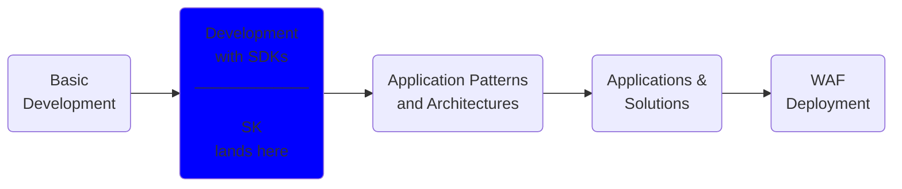

# Introduction to Semantic Kernel Development

## About this repo

This repo includes C# interactive notebooks at `notebooks/` that showcase how to run scenarios with and without Semantic Kernal. The idea is to showcase the differences between writing LLM/Chatbot apps with and without Semantic Kernel. The samples include:

- `notebooks/cars.ipynb`: A sales description generator for used cars implemented without Semantic Kernel.
- `notebooks/sk-cars.ipynb`: A sales description generator for used cars implemented with Semantic Kernel.
- `notebooks/chat.ipynb`: A GPT chatbot implementation without Semantic Kernel.
- `notebooks/sk-chat.ipynb`: A GPT chatbot implementation with Semantic Kernel.
- `notebooks/sk-pipes.ipynb`: Showcases how to use Semantic Kernel pipes.
  - **Note:** This code comes from the original dotnet/SK solution. I just have adapted it to run in C# interactive.
- `notebooks/sk-planner.ipynb`: Showcases how to use the Semantic Kernel sequential planner.
  - **Note:** This code comes from the original dotnet/SK solution. I just have adapted it to run in C# interactive.
- `notebooks/sk-memory.ipynb`: Demonstrates how to use the Semantic Kernel memories functionality.
  - **Note:** This code comes from the original dotnet/SK solution. I just have adapted it to run in C# interactive.
- `notebooks/sk-memory-rag.ipynb`: Demonstrate a RAG pattern implementation using Semantic Kernel volatile memory. Useful to understand the concepts of this pattern.
- `notebooks/sk-memory-raasg.ipynb`: Demonstrate a RAASG pattern implementation using Semantic Kernel. Useful to understand the concepts of this pattern.

**Note:** I am using C# interactive notebooks because I find them helpful for documenting, explaining, and debugging the different concepts. In productions applications, I have deployed c# projects with WebAPIs and React frontends.

## Running the demos

Requirements:

- .NET 6 or 7 SDK
- VS Code
- VS Code Polyglot extension

Running:

- In Azure create OpenAI endpoints for:
  - GPT 3.5 or 4
  - ADA Embeddings
  - Copy the deployment name, endpoint, and API key information
- Clone this repo
- Navigate to the notebooks folder within this repo
- Make sure the VS Code is installed as well as the VS Code Polyglot extension and either .NET 6 or 7
- Create a file called: `notebooks/.env` and add the following values from

```bash
GPT_OPENAI_KEY=<KEY>
GPT_OPENAI_DEPLOYMENT_NAME=<MODEL_NAME>
GPT_OPENAI_ENDPOINT=https://<NAME>.openai.azure.com/
GPT_OPENAI_FULL_ENDPOINT=https://<NAME>.openai.azure.com/openai/deployments/<MODEL>/chat/completions?api-version=2023-03-15-preview

DAVINCI_OPENAI_KEY=<KEY>
DAVINCI_OPENAI_DEPLOYMENT_NAME=<MODEL_NAME>
DAVINCI_OPENAI_ENDPOINT=https://<NAME>.openai.azure.com/
DAVINCI_OPENAI_FULL_ENDPOINT=https://<NAME>.openai.azure.com/openai/deployments/<MODEL_NAME>/completions?api-version=2022-12-01
```

- Type: 'code .'
- Open any one of the notebooks
- Click the play button at each cell and review the headings and comments

## What are some important concepts in LLM/Chatbot developement

* Understanding the difference between LLM/Chatbot model
  * An LLM (Davinci) model is for answer/response
  * An Chat (GPT) model can keep a conversation, but it can also be used in answer/response
* Understanding tokens, token limits, and working around these limits
* Understanding the prompt and completion models
* Understanding and applying prompt engineering

### This is how simple a GPT call looks like

```text
Summarize the text below as a bullet point list of the most important points.

Text: """
{text input here}
"""
```

You don't even have to write a program, you can just `curl`:

```text
curl https://YOUR_RESOURCE_NAME.openai.azure.com/openai/deployments/YOUR_DEPLOYMENT_NAME/completions?api-version=2023-05-15\
  -H "Content-Type: application/json" \
  -H "api-key: YOUR_API_KEY" \
  -d "{
  \"prompt\": \"Once upon a time\",
  \"max_tokens\": 5
}"
```

### So where is the complexity then? It is everything else.

- For example:
  - As a foundational model that can solve many problems, applying this concept is complex in itself.
  - Making resilient applications that can handle disconnections and throttling
  - Developing complex orchestrations
  - Preparing the prompts and applying prompt engineering (Grounding)
  - Saving and recalling text from embeddings, for example in the RAG pattern
  - Processing the completions

**Semantic Kernel can help with everything else.**

## What is Semantic Kernel?

- Is an open-source SDK that provides a set of connectors and plugins that allow you to orchestrate AI models and skills with natural language semantic functions, traditional native code functions, and embeddings-based memory.
- It supports prompt templating, function chaining, vectorized memory, and intelligent planning capabilities.
- It enables you to create AI apps that combine the best of both worlds: natural language understanding and conventional programming logic

## Where does SK land in the development of LLM/Chatbot applications?



## Advantages of using SK vs making REST calls or using other SDKs

- Kernel can be configured via plugins that are implemented by interfaces.
- Resilient HttpClient client that can handle timeouts and throttling.
  - Note: HttpClient in the main network object to perform Http operations in many languages.
- Semantic functions.
  - Generally, an SK function is defined as a templated prompt.
    - ie: `var skfJokeDefinition = "Write a joke about {{$$input}}.";`
    - ie: `var skSpanishTranslator = "Translate from English to Spanish: {{$$input}}";`
  - SK functions can be piped together:
    - ie:

```c#
    var result = await kernel.RunAsync("a chicken crossing the road",
        skfJokeGenerator,
        skfSpanishTranslator,
        text["uppercase"]);
```

- Output: `¿POR QUÉ CRUZÓ EL POLLO LA CARRETERA? PORQUE QUERÍA VER SI LA HIERBA ERA MÁS VERDE AL OTRO LADO. PERO RESULTA QUE ERA ARTIFICIAL Y SE QUEDÓ ATASCADO EN EL CÉSPED. ¡QUÉ POLLO TAN TONTO!`
- SK functions can be in-line, coded, or loaded from files.
- SK planner, dynamically can create complex orchestrations.
- Memories can be used to save contents with embeddings and retrieve content using the same embeddings, for example for use in the RAG pattern.

## When and when not to choose Semantic Kernel

**Note:** Semantic Kernel is still in preview. It is not yet recommended for production.

### When

- There's language support, particularly for C# and Python (more language support coming).
- The app can take advantage of the functionality provided by Semantic Kernel such as pipes, orchestration, memories, etc.
- If you need complex SK function orchestrations.
- If you need to work with embeddings.

### When not to

- SK may be too complex for simple applications.
- Obviously, if a language is not supported.

## Semantic Kernel vs Langchain


| Semantic Kernel        | LangChain                     |
| ------------------------ | ------------------------------- |
| Connectors             | Language Models (LLM/Chat)    |
| SK functions           | Prompt Templates              |
| Variables in functions | Variables in prompt templates |
| Pipes                  | Chains                        |
| Planner                | Chains                        |
| Memories               | Memory                        |
| C#, Python, Java       | Python                        |

**Memories:** Usually are helpers to generate, store, retrieve, and compare embeddings from vector databases.
